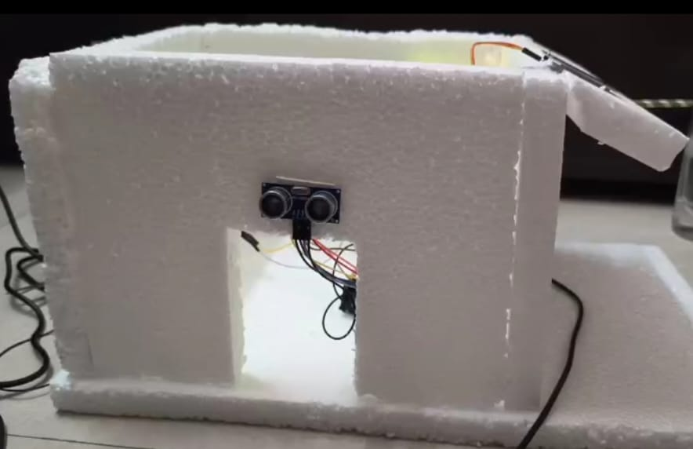
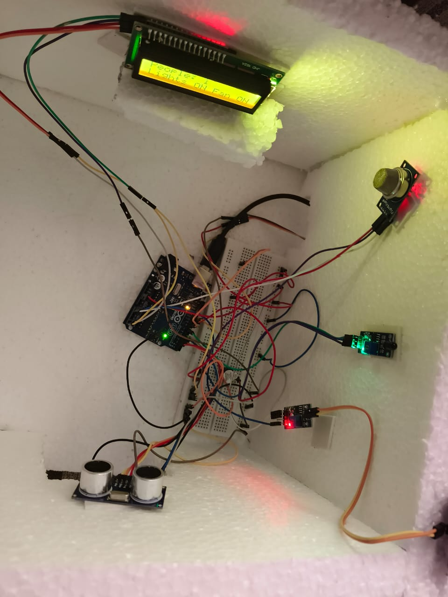

# 🏠 Smart Home Automation System using Arduino

🎉 **First Prize Winner – EmbedQuest 2025**  
🎓 **Presented at Samgatha x Vashisht**, IIITDM Kancheepuram

---

## 📌 Project Overview

This Smart Home Automation system is a fully integrated embedded solution developed using **Arduino UNO**, designed to automate home safety and convenience features. It combines multiple sensors, actuators, and alert mechanisms to deliver a smart environment that responds intelligently to real-world events like presence detection, fire, gas leaks, and rainfall.

The project was developed and demonstrated by our team as part of **EmbedQuest 2025**, where it was awarded **First Prize** for its functional depth and real-time responsiveness.

---

## 📝 Problem Statement (Provided by Organizers)

> *Design an embedded system prototype for a smart home that uses minimal components to provide automation and safety functionalities such as environmental hazard detection and occupancy-based control. The final demo must be built on an Arduino-compatible platform and should reflect real-time responsiveness and innovation in cost efficiency.*

⏳ **Time Limit**: 9 days  
🧪 **Round 1**: Abstract + Simulation (Online)  
🔬 **Round 2**: Live Working Model Demo (Onsite)

---


## 🔧 Features

- 👥 **Occupancy Detection**: Entry/Exit sensors update people count and automate lights/fan (simulated).
- 💡 **Auto Light/Fan Control**: Based on people count, status is displayed on LCD.
- 🌧️ **Rain Detection**: Detects rainfall, rotates servo to protect clothes.
- 🔥 **Flame Detection**: Alerts user with LCD message and buzzer.
- 🛢️ **Gas Leak Detection**: Detects hazardous gas levels and triggers warning.
- 📺 **LCD Display**: Real-time feedback for all status/alerts.
- 🔔 **Distinct Buzzer Patterns**: Different tones for rain, gas, and fire alerts.

---

## 🧰 Components Used

| Component             | Functionality                      |
|----------------------|-------------------------------------|
| Arduino UNO           | Main microcontroller               |
| Ultrasonic Sensors x2 | Entry/Exit monitoring              |
| Rain Sensor (Analog)  | Detects rain                       |
| Flame Sensor          | Fire detection                     |
| MQ-2 Gas Sensor       | Detects LPG/Gas leaks              |
| Servo Motor (SG90)    | Moves cloth cover mechanism        |
| I2C LCD 16x2          | Displays messages/status           |
| Relay Module          | [Simulated] appliance switching    |
| Buzzer                | Audible hazard alerts              |

---

## 🔁 System Logic

1. **Entry/Exit Monitoring**
   - 2 ultrasonic sensors detect direction of motion.
   - People count is incremented/decremented.
   - If count > 0: Display "Lights ON, Fan ON"  
   - If count = 0: Display "Lights OFF, Fan OFF"

2. **Rain Detection**
   - Analog rain sensor detects moisture.
   - Servo rotates to cover hanging clothes.
   - LCD shows “Rain Detected”.
   - Buzzer tone sweeps from 500–2000 Hz.

3. **Flame Detection**
   - Flame sensor detects infrared radiation from fire.
   - LCD: “FLAME ALERT” + “DOORS OPEN”
   - Buzzer beeps rapidly at 2000 Hz.

4. **Gas Detection**
   - MQ-2 analog value crosses a threshold.
   - LCD: “GAS LEAKAGE” + “DOORS OPEN”
   - Buzzer gives medium alert at 1500 Hz.

---

## 🔊 Buzzer Alerts

| Alert Type | Sound Pattern               |
|------------|-----------------------------|
| Fire       | Fast beeping @ 2000 Hz      |
| Gas Leak   | Medium beeping @ 1500 Hz    |
| Rain       | Rising–falling tone sweep   |

---

## 📺 LCD Display Messages

- **Welcome Message**: On entry → `Welcome Home`
- **Exit Message**: On last exit → `Thank You`
- **Status View**:
- Line 1: People: X
- Line 2: Lights & Fan ON  or OFF

- **Alert Display**:
- Fire → `FLAME ALERT  \nDOORS OPEN`
- Gas  → `GAS LEAKAGE  \nDOORS OPEN`
- Rain → `RAIN DETECTED  \nCLOTHS PROTECTED`

---
📂 **Source Code**  
👉 [Click here to view the Arduino code](Arduino_code.ino)


## 🧠 Code Highlights

```cpp
getDistance();             // Reads ultrasonic range
calibrateGasSensor();      // Sets gas sensor baseline
getFilteredGasValue();     // Averaged analog gas value
updateLCD();               // Dynamic LCD updates
fireAlarm();               // Fire buzzer + LCD logic
gasAlarm();                // Gas buzzer + LCD logic
rainAlarm();               // Rain buzzer + servo logic
showMessage();             // Reusable LCD msg function
```
## 🏠 Hardware Setup Preview

Here is the physical prototype of our Smart Home Automation System developed during EmbedQuest 2025:





# 👥 Team Members

This project was developed by students of 
**Madras Institue Of Technology(Anna University),Chrompet**
 | Name             |
|------------------|
|Anusree S         |
|Nivetha N         |
| Reshmi R        |
| Roshinee P     | 


